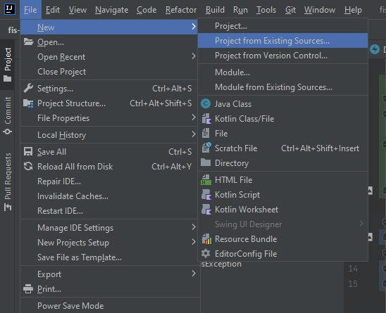
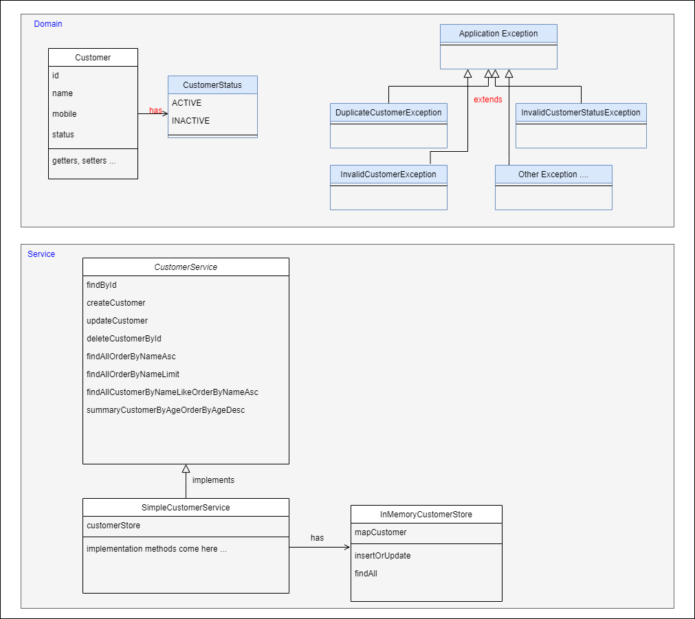

##### MINITEST 01 - Simple Customer Management System

##### 01. Project setup
````
 git clone https://github.com/quynv86/fis-training-06-2022.git
````
Open IntelliJ and create new project from existing source as below




##### 02. Class Diagram



##### 03. TODO
 Sinh viên implement cac method trong class SimpleCustomerService, InMemoryCustomerStore 
 dựa trên đặc tả của interface CustomerService