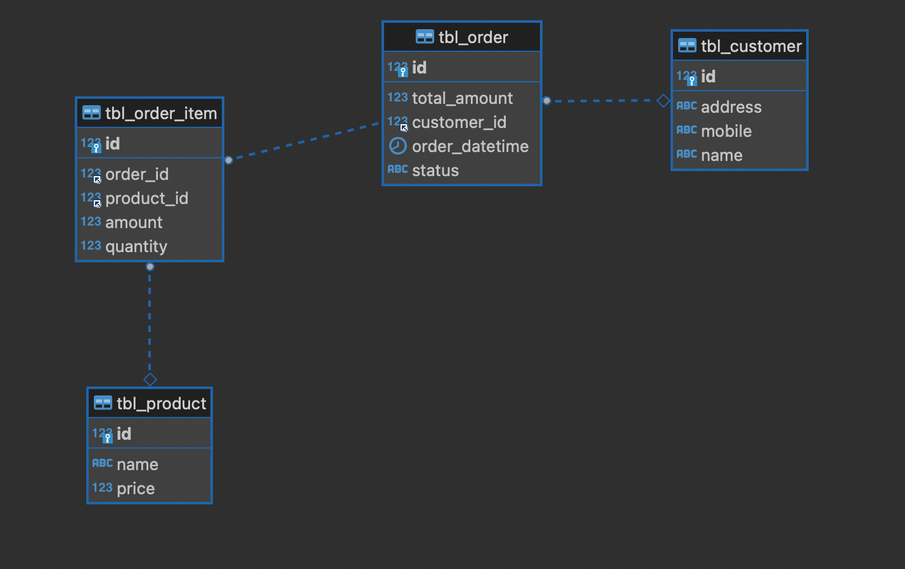

#### Data Model


#### 1. Customer: 
1. id : Long 
2. address: String
3. name : String

#### 2. Product:
1. id : Long
2. name: String
3. price : Double

#### 3. Order:
1. id : Long
2. customer_id: khoa ngoai den bang customer 
3. order_datetime : LocalDateTime
4. status : Xem trong OrderStatus class
5. total_amount: Double ( Tong tien cua order bang tong tien cua cac order_item trong orderItem)
#### 3. OrderItem:
1. id : Long
2. order_id: Khoa ngoai den bang order
3. product_id: Khoa ngoai den bang product
4. quantity: so luong cua product
5. amount: bang quantity * price (cua product)


#### 4. TESTING
De thuc hien test, cac ban inject cac service can test vao class OrderManagermentApplication va thu thi method
thong qua CommandLineRunner nhu ben duoi
```aidl
	@Autowired
	private OrderService orderService;
	@Bean
	CommandLineRunner commandLineRunner() {
		return new CommandLineRunner() {
			@Override
			public void run(String... args) throws Exception {
				log.info("Welcome to spring application. Pls write test method in here to run for testing only");
				log.info("Total order with wating status : {} order(s)", orderService.findOrdersByOrderStatus(OrderStatus.WAITING_APPROVAL).size());
			}
		};
	}
```


